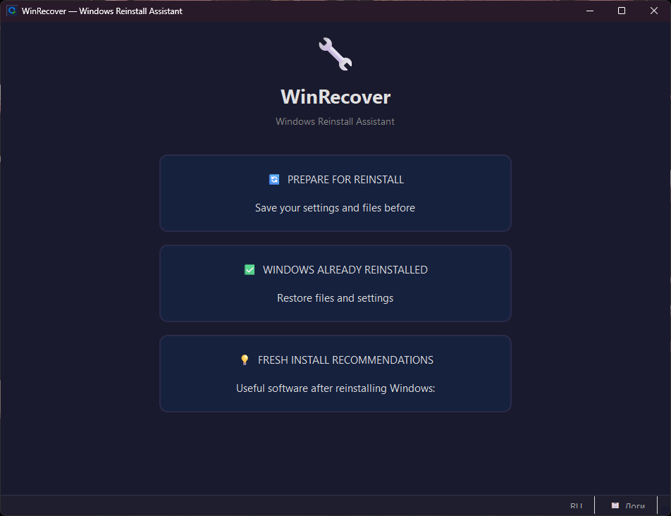

# WinRecover

[](../../releases/latest)
[](../../releases/latest)
[](LICENSE)
[](#)

**Windows Reinstall Assistant** — a tool that helps you back up configs, personal files, and the list of installed programs before a clean Windows install, and restore everything afterward.

> [Русская версия →](README.md)



---

## Features

### Before Reinstalling
- **AppData Scanning** — finds configs of installed programs (VS Code, Discord, OBS, JetBrains, etc.) with recommendations on what's worth keeping vs. what restores automatically
- **SSH Keys** — automatically locates `~/.ssh/` and offers to include it in the backup
- **Personal Files** — Documents, Pictures, Videos, Music, Downloads
- **Program List** — scans the Windows registry, groups by category, generates a Markdown file for easy reinstallation
- **Games Warning** — detects games on drive C: from Steam, Epic Games, and GOG Galaxy
- **Obsidian Warning** — finds local Obsidian vaults
- **Backup Creation** — copies or archives selected files to another drive

### After Reinstalling
- Browse the backup with a file tree view
- Installed programs list for manual reinstallation
- Restore files from the backup

### Fresh Install Recommendations
- Curated list of useful software by category: tweaks, customization, development, security, media, and more
- Links to the official page of each tool

---

## Download

> The `.exe` requires no installation — download it from [Releases](../../releases/latest) and run.

---

## Run from Source

### Requirements
- Windows 10 / 11
- Python 3.11+

### Setup

```bash
git clone https://github.com/YOUR_USERNAME/WinRecover.git
cd WinRecover
pip install -r requirements.txt
python main.py
```

### Dependencies

| Package | Purpose |
|---------|---------|
| `PySide6` | GUI (Qt6) |
| `psutil` | Disk and partition info |
| `py7zr` | Creating .7z archives |

---

## Project Structure

```
WinRecover/
├── main.py                    # Entry point
├── config_manager.py          # Backup config management
├── requirements.txt
├── assets/                    # Icon and screenshots
├── core/
│   ├── system_detector.py     # Auto-detect state (before/after reinstall)
│   ├── file_scanner.py        # AppData, personal files, SSH scanning
│   ├── games_scanner.py       # Game scanning (Steam, Epic, GOG) and Obsidian
│   └── programs_scanner.py    # Installed programs via Windows registry
├── ui/
│   ├── app.py                 # Main window, screen navigation
│   ├── style.py               # Dark theme (QSS)
│   ├── start_screen.py        # Start screen
│   ├── prepare_screen.py      # Preparation screen (steps 1–4)
│   ├── restore_screen.py      # Restore screen
│   ├── recommendations_screen.py  # Software recommendations
│   └── components/
│       ├── file_list.py       # Custom QTreeWidget with checkboxes
│       ├── disk_info.py       # Disk info widget
│       └── progress_modal.py  # Modal progress dialog
└── utils/
    ├── helpers.py             # Utility functions
    └── i18n.py                # Localization (RU / EN)
```

---

## License

[MIT](LICENSE)
